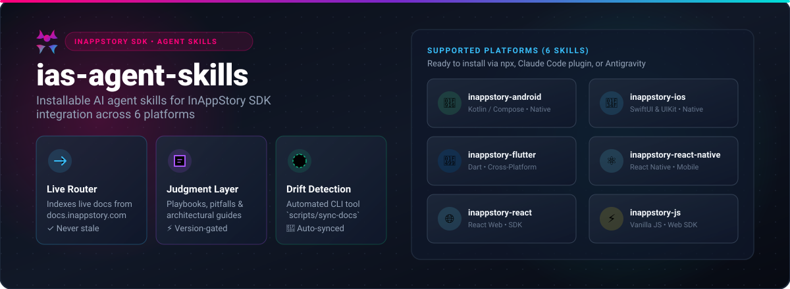
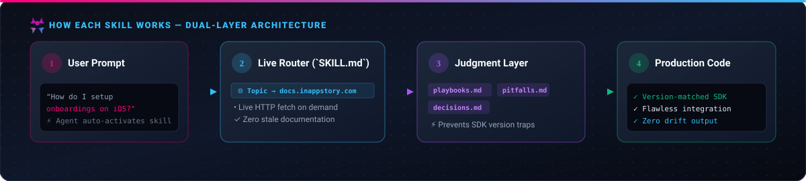

<p align="center">
  <a href="https://inappstory.com">
    
  </a>
</p>

<p align="center">
  <b>Supercharge AI coding agents with installable skills for integrating the <a href="https://inappstory.com">InAppStory (IAS)</a> SDK into Mobile & Web applications.</b>
</p>

<p align="center">
  <a href="#-skills-matrix"></a>
  <a href="#%EF%B8%8F-how-each-skill-works"></a>
  <a href="#-maintaining--drift-detection"></a>
  <a href="LICENSE"></a>
</p>

---

## ⚡ Skills Matrix

Installable agent skills providing complete InAppStory SDK coverage for all major mobile and web tech stacks:

| Skill | Platform | Language & Framework | Package / Entry Point |
| :--- | :--- | :--- | :--- |
| [`inappstory-android`](skills/inappstory-android) | **Android** | Kotlin, Jetpack Compose, UIKit | `com.github.inappstory:android-sdk` |
| [`inappstory-ios`](skills/inappstory-ios) | **iOS** | Swift, SwiftUI & UIKit | `InAppStory` / `InAppStory_SwiftUI` |
| [`inappstory-flutter`](skills/inappstory-flutter) | **Flutter** | Dart | `inappstory_plugin` |
| [`inappstory-react-native`](skills/inappstory-react-native) | **React Native** | TypeScript / JavaScript | `@inappstory/react-native-sdk` |
| [`inappstory-react`](skills/inappstory-react) | **React** | Web (React 16.8+) | `@inappstory/react-sdk` |
| [`inappstory-js`](skills/inappstory-js) | **Vanilla JS** | Browser / Web SDK | `@inappstory/js-sdk` |

---

## 🏗️ How Each Skill Works

<p align="center">
  
</p>

Each skill combines a **Live Documentation Router** with a **Curated Judgment Layer**:

1. 🌐 **Live Router (`SKILL.md`)**: Maps topic queries directly to live `docs.inappstory.com` URLs. Your AI agent fetches the latest documentation on demand — **content never goes stale**.
2. 🧠 **Judgment Layer (`playbooks.md`, `pitfalls.md`, `decisions.md`)**: Contains cross-page implementation recipes, version traps, and architectural trade-offs that standard documentation doesn't synthesize in one place.

---

## 🚀 Quick Installation

#### 📦 Skills CLI — Claude Code · Codex · Cursor · 70+ agents
One command installs all six skills into **every agent it detects** — Claude Code (`~/.claude/skills`), Codex (`~/.codex/skills`), Cursor (`~/.cursor/skills`), and more:
```bash
npx skills add https://github.com/inappstory/agent-skills --skill '*'
```
Target a single agent with `--agent` (e.g. `codex`, `claude-code`, `cursor`, `github-copilot`):
```bash
npx skills add https://github.com/inappstory/agent-skills --skill '*' --agent codex
```

#### 🧩 Claude Code — plugin
```bash
/plugin marketplace add https://github.com/inappstory/agent-skills.git
/plugin install inappstory@ias-agent-skills
```

#### 🚀 Antigravity / AGY CLI
Clone the repository and copy the skills into your local `.agents` directory:
```bash
git clone https://github.com/inappstory/agent-skills.git
cp -R agent-skills/skills/inappstory-* ~/.agents/skills/
```

<details>
<summary><b>🔗 Manual & advanced</b></summary>

<br>

#### 🔗 Manual symlink
```bash
git clone https://github.com/inappstory/agent-skills.git
ln -s $(pwd)/agent-skills/skills/inappstory-* ~/.agents/skills/
```

#### 📁 Offline / local folder
Install from a folder instead of the network — handy for air-gapped setups or a
private fork. `skills add <folder>` targets any agent (`cursor`, `claude-code`, …):
```bash
git clone https://github.com/inappstory/agent-skills.git
npx skills add ./agent-skills/skills --skill '*' --agent '*' -y
```
Pass the archive as a **folder**, not a `.zip` — unzip it first (`unzip agent-skills.zip`),
then point `skills add` at the extracted `skills/` directory.

#### 🔄 Updating & pinning a version
`skills` records the source in `skills-lock.json`, so pulling the latest is just:
```bash
npx skills update            # re-fetches the latest and reinstalls
```
To pin a specific release instead of tracking latest, append a git tag with `#`:
```bash
npx skills add https://github.com/inappstory/agent-skills#v0.1.0 --skill '*'
```

</details>

---

## 💬 Usage

Once installed, simply prompt your AI agent about any InAppStory SDK integration task — the relevant skill triggers automatically:

> *"How do I set up onboarding stories in InAppStory on iOS?"*  
> *"Show me how to pass custom user tags to the Android IAS SDK."*  
> *"How do I implement custom Story feeds in React Native?"*

---

## 🔄 Maintaining & Drift Detection

When a new version of the InAppStory SDK or documentation is released, run `scripts/sync-docs` to audit for any documentation drift:

```bash
# Pull latest docs repo and report new, removed, or modified pages
scripts/sync-docs --pull

# Save current docs state as the new baseline after updating judgment files
scripts/sync-docs --save
```

`sync-docs` automatically detects missing topic links, deleted pages, and content updates so maintainers can keep the judgment layer pristine. See [`AGENTS.md`](AGENTS.md) for full maintainer instructions.

### Cutting a Release

Version lives in [`.claude-plugin/plugin.json`](.claude-plugin/plugin.json) and each release is a matching `vX.Y.Z` git tag — the one number both the Claude Code plugin manager and `npx skills ...#tag` pinning read. Add a [`CHANGELOG.md`](CHANGELOG.md) entry, commit it, then:

```bash
scripts/release 0.3.0        # bumps plugin.json, commits, tags v0.3.0
git push && git push origin v0.3.0
```

---

## 📂 Repository Layout

```text
skills/inappstory-<platform>/   # Product skills (one per platform)
  SKILL.md                      # Live router (topic index -> docs URLs)
  playbooks.md                  # Step-by-step task workflows
  pitfalls.md                   # Version traps & edge-case gotchas
  decisions.md                  # Architectural decision guides
assets/readme/                  # Pure SVG visual system (hero.svg, architecture.svg)
scripts/sync-docs               # Maintainer CLI tool for docs drift detection
scripts/release                 # Bump plugin version, commit, and tag a release
.claude-plugin/                 # Claude Code plugin and marketplace manifests
AGENTS.md  CLAUDE.md  README.md
```

---

<p align="center">
  <sub>Powered by <a href="https://inappstory.com">InAppStory</a> • Grounded in official SDK documentation</sub>
</p>
